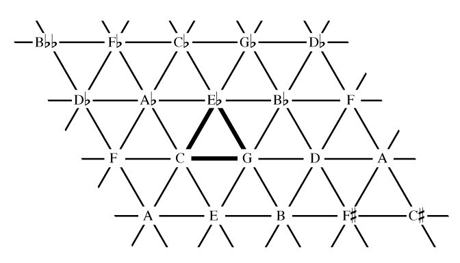
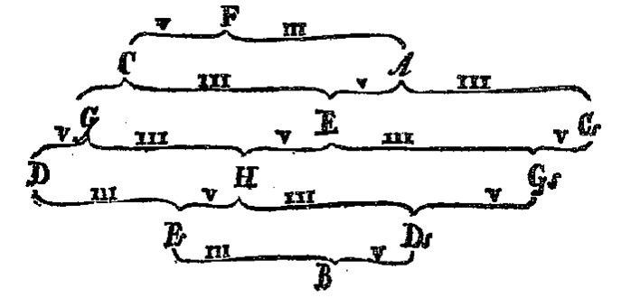

# The Eulerian Keyboard

This Clojure program uses [Overtone](http://overtone.github.io) to produce sound and [Quil](https://github.com/quil/quil) to draw the keyboard.

This keyboard with [rhombitrihexagonal tiling](http://en.wikipedia.org/wiki/Rhombitrihexagonal_tiling) arranges the 12 musical tones
in a way to easily access chords in addition to single notes.

One way to represent the 12 tones is the [circle of fifths] (http://en.wikipedia.org/wiki/Circle_of_fifths).

Another way is to use a lattice or a graph.
In 1739, the Swiss mathematician and physicist [Leonard Euler] (http://en.wikipedia.org/wiki/Leonhard_Euler)
published a lattice called a [tonnetz](http://en.wikipedia.org/wiki/Tonnetz).
You can see the circles of fifths repeated in the tonnetz.

Some of muscial relationships easily recognized from the Eulerian keyboard are [major](http://en.wikipedia.org/wiki/Major_triad) and [minor triads](http://en.wikipedia.org/wiki/Minor_triad), [perfect fifths](http://en.wikipedia.org/wiki/Perfect_fifth),
[perfect fourths](http://en.wikipedia.org/wiki/Perfect_fourth), and [major](http://en.wikipedia.org/wiki/Major_third) and [minor thirds](http://en.wikipedia.org/wiki/Minor_third).

## Music Tiles

* Labeled hexagon - a note
* Square - dyad chord of the two notes on two sides
* Triangle - triad chord of the three notes at the vertices

Each row on the keyboard is an octave.
The lowest notes are on the bottom, and the highest on the top. The C in the center is middle C (C4 in [MIDI] (http://en.wikipedia.org/wiki/Midi)).

## Making Noise

* To play
 * Mode 1 - Drag the mouse over the notes and chords
 * Mode 2 - Click to play individual notes or chords
 * Press any key on the keyboard with switch between the modes.

Due to the lousy interface of a keyboard and a mouse, Mode 1 is recommended.
The sound is a simple triangle wave, unless you can connect a MIDI instrument.

## License

Copyright © 2014 Shelley Marshall

Distributed under the Eclipse Public License either version 1.0 or (at
your option) any later version.
